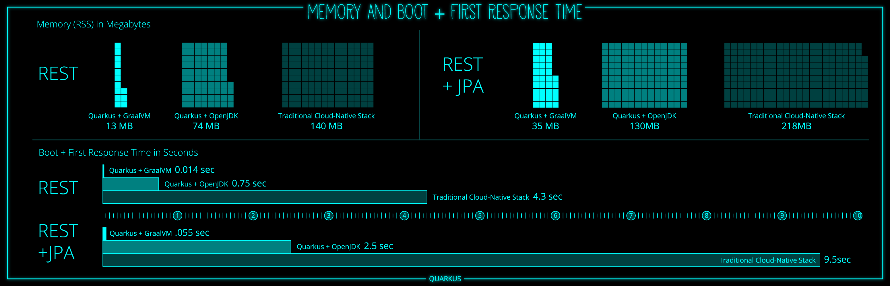

#### Supersonic Subatomic Java

---

* Quarkus is a Cloud Native, Container First Java framework
* Crafted from best-of-breed Java libraries and standards
* Tailored for GraalVM and OpenJDK HotSpot 

---

Alternative to Spring Boot, Micronaut 

---

### Container first

* Fast Startup 
* Low memory utilization 

Note: 
* (tens of milliseconds) allows automatic scaling up and down of microservices on containers and Kubernetes as well as Serverless / FaaS on-the-spot execution, scale to zero approach
* helps optimize container density in microservices architecture deployments requiring multiple containers

---



---

### Developer Joy

* Unified configuration with all configuration in a single property file.
 
* Zero config, streamlined code for the 80% common usages, flexible for the 20%

* Live reload, debugger starts by default on port 5005

---

* No hassle native executable generation:       
```commandline
mvn package -Pnative
``` 

* Quarkus extension framework reduces the complexity for making third-party frameworks run on Quarkus and compile to a GraalVM native binary

* Kotlin support

---

Use programming model you already know

---

→ Inject dependencies with CDI annotations

---

→ Expose RESTful APIs using JAX-RS 

---

→ Talk to DB with JPA/Hibernate

---

### Eclipse MicroProfile support 

* Write fault-tolerant code
* Secure apps with MicroProfile JWT
* Monitor apps with MicroProfile OpenTracing, Metrics and Health

---

### Unifies Imperative and Reactive

Note: 
* Most Java developers are familiar with the imperative programming model and would like to utilize that experience when adopting a new platform 
* At the same time, developers are rapidly adopting a cloud native, event-driven, asynchronous, and reactive model to address business requirements to build highly concurrent and responsive applications 
* Quarkus is designed to seamlessly brings the two models together in the same platform

---

Imperative

```java
@Inject
SayService say;

@GET
@Produces(MediaType.TEXT_PLAIN)
public String hello() {
    return say.hello();
}
```

---

Reactive

```java
@Inject @Stream("kafka")
Publisher<String> reactiveSay;

@GET
@Produces(MediaType.SERVER_SENT_EVENTS)
public Publisher<String> stream() { 
    return reactiveSay; 
}
```

---

Get quarked! and let’s start building some hadrons

---

Create a new project:

```commandline
mvn io.quarkus:quarkus-maven-plugin:0.21.1:create \
    -DprojectGroupId=com.example \
    -DprojectArtifactId=movies-app \
    -DclassName="com.example.GreetingResource" \
    -Dpath="/hello"
```

---

Start application in dev mode: 

```commandline 
./mvnw compile quarkus:dev 
``` 
<!-- .element: style="text-align:center" -->

---

Create class `GreetingService`:

```java
@ApplicationScoped
class GreetingService {

    String greeting(String name) {
        return "Hello, " + name;
    }
} 
```

---
    
modify the `GreetingResource` class, injecting the `GreetingService` and adding a new method:

```java
@Inject
GreetingService greetingService;

@GET
@Produces(MediaType.TEXT_PLAIN)
@Path("/{name}")
public String hello(@PathParam("name") String name) { 
    return greetingService.greeting(name);
}
```

Note:
Do not use private modifier on injected fields - Quarkus must use reflection fallback to access private members (which entails bigger native executable) or use private fields and package-private constructor. 

---

Create a new property in `application.properties`
```properties
greeting=Good morning {0}!
```
<!-- .element: style="text-align:center" -->

---

Modify the `GreetingService` to use new property:

```java
@ConfigProperty(name = "greeting")
private String greeting;

String greeting(String name){
    return MessageFormat.format(greeting, name);
}
```

---

Use _package-private_ modifier: 

```java
@ConfigProperty(name = "greeting")
String greeting;
```

---

### Packaging Quarkus application

```commandline
./mvnw package
```
<!-- .element: style="text-align:center" -->

---
 
#### Produces two jars:

* `movies-app-1.0-SNAPSHOT.jar`
   * containing just the classes and resources of the projects
   
* `movies-app-1.0-SNAPSHOT-runner.jar`
   * an executable jar with the dependencies copied to `target/lib`

```commandline
java -jar target/movies-app-1.0-SNAPSHOT-runner.jar
```
<!-- .element: style="text-align:center" -->

Note:
* first - regular artifact produced by the Maven
* `*-runner.jar` is not a fat jar, it's a thin jar
    * separates concerns of libraries and our own code
    * Docker - as long as dependencies are not changed, the library layer is reused and built only once 

---

### Using Hibernate ORM and JPA

```commandline
./mvnw quarkus:add-extension \
    -Dextensions="quarkus-hibernate-orm,quarkus-jdbc-h2,quarkus-smallrye-openapi,quarkus-resteasy-jsonb"
```
<!-- .element: style="text-align:center" -->

---

Add configuration to `application.properties`:

```properties
quarkus.datasource.url=jdbc:h2:mem:test;Mode=Oracle;
quarkus.datasource.driver=org.h2.Driver
quarkus.datasource.username=username-default
quarkus.hibernate-orm.dialect=org.hibernate.dialect.Oracle10gDialect
quarkus.hibernate-orm.database.generation=create
quarkus.hibernate-orm.log.sql=true
```

---

Create an entity class: 

```java
@Data
@Entity
public class Movie {

    @Id 
    @GeneratedValue
    private Long id;
    private String title;
    private String genre;
    private int year;
}
```

---

Add lombok dependency:

```xml
<dependency>
  <groupId>org.projectlombok</groupId>
  <artifactId>lombok</artifactId>
  <version>1.18.8</version>
</dependency>
```

---

Create a service:

```java
@ApplicationScoped
public class MovieService {
    @Inject
    EntityManager em;

    List<Movie> all() {
        return em.createQuery("SELECT e FROM Movie e").getResultList();
    }

    @Transactional
    void save(Movie movie) {
        em.persist(movie);
    }
}
```

---

Create an `import.sql` script in resources:

```sql
insert into movie(id, title, genre, year) values
    (hibernate_sequence.nextVal, 'The Shawshank Redemption', 'Drama', 1994),
    (hibernate_sequence.nextVal, 'One Flew Over the Cuckoo''s Nest', 'Drama', 1975),
    (hibernate_sequence.nextVal, 'The Lord of the Rings: The Fellowship of the Ring', 'Adventure, Drama, Fantasy', 2001),
    (hibernate_sequence.nextVal, '12 Angry Men', 'Drama', 1957);
```

---

Create a rest endpoint:

```java
@Path("/movies")
@Produces(MediaType.APPLICATION_JSON)
@Consumes(MediaType.APPLICATION_JSON)
public class MovieResource {

    @Inject
    MovieService movieService;

    @GET
    public List<Movie> movies() {
        return movieService.all();
    }

    @POST
    public void save(Movie movie) {
        movieService.save(movie);
    }
}
```

---

SwaggerUI

Note:
Bug in `undertow` on Windows using dev mode. Either run from jar or use postman.  

---

Switch to Panache

```commandline
./mvnw quarkus:add-extension \
    -Dextension="quarkus-hibernate-orm-panache"
```
<!-- .element: style="text-align:center" -->

---

* Extend entity class with `PanacheEntity`

* Remove `id` field

* Make use of `PanacheEntity` static methods

Note:
"IDs are often a touchy subject, and not everyone’s up for letting them handled by the framework" - we can define own ID strategy by extending `PanacheEntityBase` instead of `PanacheEntity` and declaring public ID field.

---

```java
@Data
@Entity
@EqualsAndHashCode(callSuper = true)
public class Movie extends PanacheEntity {

    static final String YEAR = "year";
    static final Sort SORT_BY_YEAR = Sort.by(YEAR);

    private String title;
    private String genre;
    private int year;

    public static List<Movie> listAll() {
        return listAll(SORT_BY_YEAR);
    }

    static List<Movie> listByYear(int year) {
        return list(YEAR, year);
    }
}
```

---

```commandline
rm MovieService.java
```
<!-- .element: style="text-align:center" -->

---

Update `MovieResource` class:

```java
@Path("/movies")
@Produces(MediaType.APPLICATION_JSON)
@Consumes(MediaType.APPLICATION_JSON)
public class MovieResource {

    @GET
    public List<Movie> movies(@QueryParam(YEAR) Integer year) {
        return Optional.ofNullable(year)
            .map(Movie::listByYear)
            .orElseGet(Movie::listAll);
    }

    @POST
    @Transactional
    public void save(Movie movie) {
        movie.persist();
    }
}
```

---

MicroProfile Rest Client

```commandline
./mvnw quarkus:add-extension -Dextension="rest-client"
```
<!-- .element: style="text-align:center" -->

---

Create a POJO class:

```java
@Data
public class Rating {

    double imdbRating;
    String imdbVotes;
    @JsonbProperty("Title")
    String title;
}
```

---

Create an interface

```java
@Path("/")
@RegisterRestClient
public interface RatingService {

    @GET
    @Produces("application/json")
    Rating getByTitle(@QueryParam("t") String title);
}
```

Note:
`@RegisterRestClient` allows Quarkus to know that this interface is meant to be available for CDI injection as a REST Client - not needed?

---

Create the configuration

```properties
com.example.RatingService/mp-rest/url=http://www.omdbapi.com/?apikey=PlzBanMe
```

---

Inject REST client and add a new endpoint

```java
    @Inject
    @RestClient
    RatingService ratingService;

    @GET
    @Path("/{id}/rating")
    public Rating rating(@PathParam("id") Long id) {
        String title = Movie.<Movie>findById(id).getTitle();
        return ratingService.getByTitle(title);
    }
```

---

Let's suppose our RatingService may fail...

```java
@Slf4j
public class MovieResource {
    //...    
    private AtomicLong counter = new AtomicLong(0);
    //...
    public Rating rating(@PathParam("id") Long id) {
        Long invocationNumber = counter.getAndIncrement();
        maybeFail(invocationNumber);
        log.info("Rating invocation #{} succeeded", invocationNumber);
        //...
    }

    private void maybeFail(Long invocationNumber) {
        if (new Random().nextBoolean()) {
            log.error("Rating invocation #{} failed", invocationNumber);
            throw new RuntimeException("Could not fetch data.");
        }
    }
}
```

---

MicroProfile Fault Tolerance

```commandline
./mvnw quarkus:add-extension -Dextension="smallrye-fault-tolerance"
```
<!-- .element: style="text-align:center" -->

---

`@Retry`

```java
@Retry(maxRetries = 4)
public Rating rating(@PathParam("id") Long id) {
    //...
}
```

Note:

Retry options:
* maxRetries 
* retryOn / abortOn
* maxDuration, durationUnit 
* delay, delayUnit
* jitter, jitterDelayUnit
